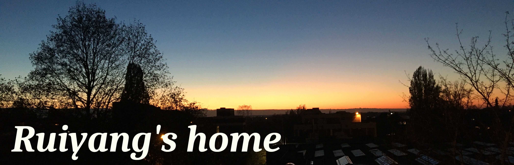

---

**Ruiyang DAI** completed his master in Mechanical Engineering at Ecole Centrale de Nantes in France in 2016.

Now he is a PhD researcher at Université catholique de Louvain.

His project is _Fast Helmholtz solvers on Multi-Threaded Atchitectures_ under the supervision of Prof. Jean-François Remacle.

Email adress: __ruiyang.dai@uclouvain.be__

# 1 Nonlinear Eigenvalue problems

Introduction to general eigenvalue problems with contour integrals.

## Context 

| Name   | Author   | File     |
| ------ | :------: | :------: |
| Contour integrals and Rayleigh-Ritz procedure in nonlinear eigenvalue problems  | R. DAI | [Download](https://gitlab.com/ruiyang/blog/-/raw/master/READMEFILES/ci_rr_full.pdf?inline=false) |

## References
1. Beyn's algorithm 
    + [Wolf-Jurgen Beyn. *An integral method for solving nonlinear eigenvalue problems*.](https://www.sciencedirect.com/science/article/pii/S0024379511002540)
    + [Marc Van Barel, Peter Kravanja. *Nonlinear eigenvalue problems and contour integrals*.](https://www.sciencedirect.com/science/article/pii/S037704271500374X)
2. SS-RR algorithm 
    + [Shinnosuke Yokota and Tetsuya Sakurai. *A projection method for nonlinear eigenvalue problems using contour integrals*.](https://www.jstage.jst.go.jp/article/jsiaml/5/0/5_41/_article/-char/en)
    + [Tetsuya Sakurai and Hiroto TADANO. *Cirr: A rayleigh-ritz type method with contour integral for generalized eigenvalue problems*.](https://projecteuclid.org/download/pdf_1/euclid.hokmj/1272848031)
3. FEAST algorithm 
    + [Eric Polizzi. *A density matrix-based algorithm for solving eigenvalue problems*.](https://arxiv.org/pdf/0901.2665.pdf)
    + [James Kestyn, Eric Polizzi, and Ping Tang. *Feast eigensolver for non-hermitian problems*.](https://arxiv.org/pdf/1506.04463.pdf)
    + [Brendan Gavin, Agnieszka Miȩdlar, and Eric Polizzi. *Feast eigensolver for nonlinear eigenvalue problems*.](https://arxiv.org/pdf/1801.09794.pdf)
4. Nonlinear Rayleigh-Ritz iterative method
    + [Ben-Shan Liao, et. al. *Nonlinear Rayleigh-Ritz iterative method for solving large scale nonlinear eigenvalue problems*.](https://projecteuclid.org/download/pdf_1/euclid.twjm/1500405872)

# 2 Domain decomposition methods

Talk at [Eccomas Congress 2020 \& 14th WCCM](https://www.wccm-eccomas2020.org/).

## Slides 

| Name   | Author   | File     |
| ------ | :------: | :------: |
| Parallel Sweeping Preconditioners for CDDs Applied to the Helmhlotz Equation  | R. DAI | [Download]() |

## Videos 

| Name   | Author   | File     |
| ------ | :------: | :------: |
| Parallel Sweeping Preconditioners for CDDs Applied to the Helmhlotz Equation  | R. DAI | [Watch now](https://studio.slideslive.com/web_recorder/share/20201128T150506Z__WCCM-ECCOMAS20__1810__parallel-sweeping-precondition?s=139c1733-d62b-42b9-9ba7-2b486284cf2b) |

## References

1.  Yassine Boubendir, Xavier Antoine, Christophe Geuzaine, [*A Quasi-Optimal Non-Overlapping Domain Decomposition Algorithm for the Helmholtz Equation*.](https://hal.archives-ouvertes.fr/hal-00573550/document)
2.  A. Modave, C. Geuzaine, X. Antoine, [*Corner treatments for high-order local absorbing boundary conditions in high-frequency acoustic scattering*.](https://reader.elsevier.com/reader/sd/pii/S0021999119307351?token=92F0F4F3F187F62E6BD38BCE4698675075D1381A9846D684D18D0E3A27F39351BB1859F7C7F0F562294E0C0798E442A4)
